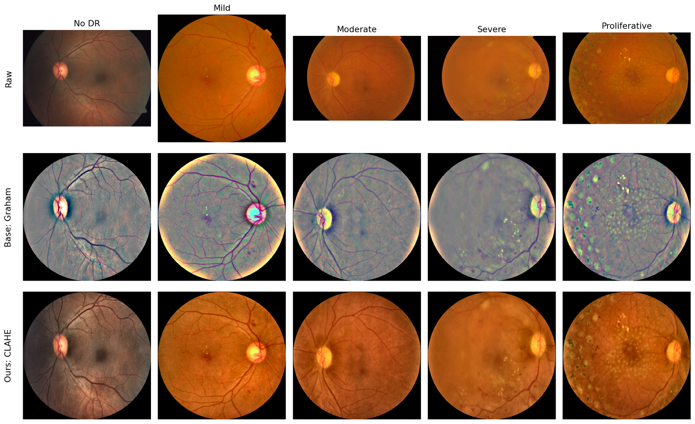
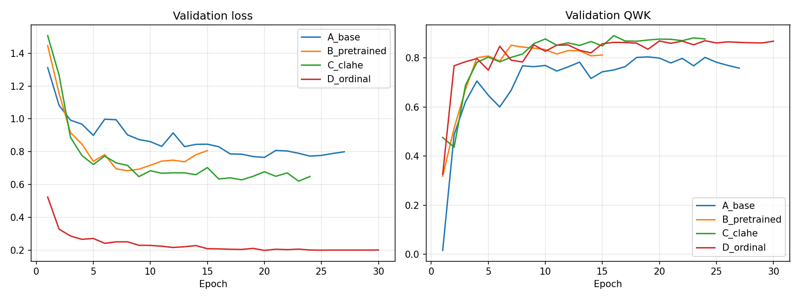
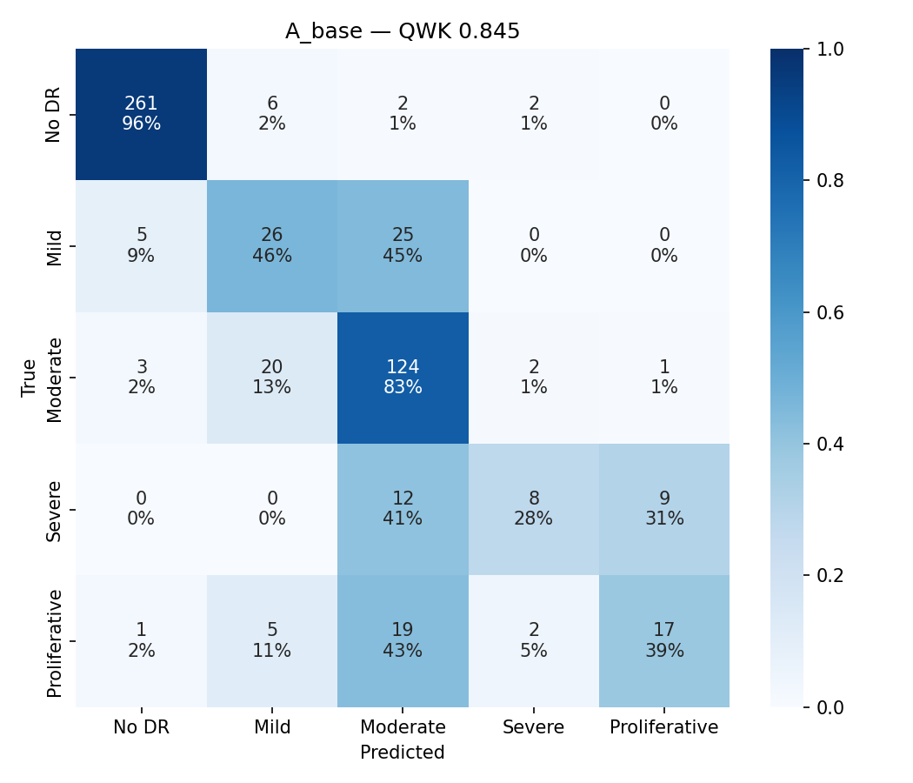
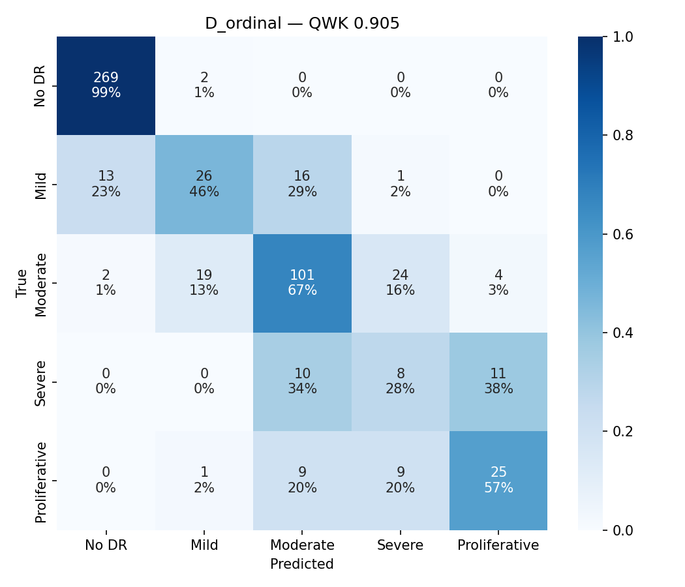
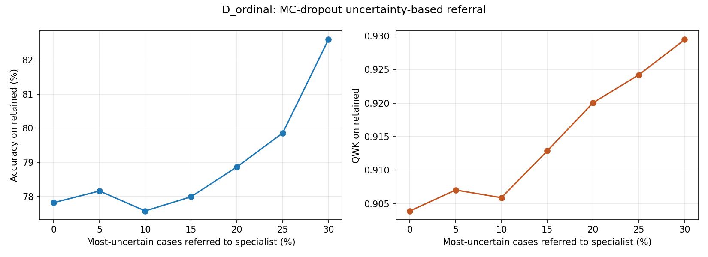
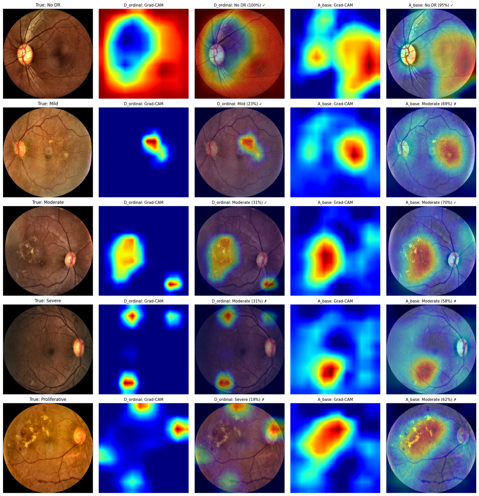

# Deep Learning-Based Diabetic Retinopathy Severity Grading Using an Attention-Enhanced Hybrid Vision Transformer with Uncertainty Estimation

Re-implementation of **LSD-HybridViT** (Gou et al., *IEEE Access*, 2025) — MobileViT + LMA
attention + JDPM frequency multi-scale block — extended with four enhancements:

| | Enhancement | Purpose |
|---|---|---|
| E1 | ImageNet-pretrained backbone | Reduce over-fitting on a small dataset |
| E2 | CLAHE preprocessing | Boost lesion contrast while keeping colour |
| E3 | Ordinal (CORAL-style) output layer | Respect the order of DR grades, fewer large errors |
| E4 | Monte Carlo dropout | Estimate uncertainty and refer doubtful cases |

## ▶ Live demo
[](https://colab.research.google.com/github/snehasanjay/DR-Grading-HybridViT/blob/main/demo.ipynb)

Open `demo.ipynb` in Google Colab → *Runtime → Run all* → upload a fundus photograph.
The model returns the DR grade, class probabilities, a Grad-CAM heatmap, its uncertainty,
and a referral recommendation. Runs on the free CPU runtime in under a minute.

Command-line equivalent:
```bash
pip install -r requirements.txt
python -m src.predict --ckpt weights/D_ordinal.pt --image your_fundus.png
```

## Results — APTOS 2019, held-out test set (550 images)

| Model | Accuracy | Macro F1 | QWK | Severe+Prolif. recall |
|---|---|---|---|---|
| A: LSD-HybridViT (our reproduction) | 79.3% | 60.5% | 0.845 | 33.1% |
| B: A + pretraining | 80.4% | 64.9% | 0.886 | 46.4% |
| C: B + CLAHE | **81.8%** | **66.0%** | 0.898 | **47.4%** |
| D: C + ordinal layer (**final model**) | 78.0% | 59.9% | **0.905** | 42.2% |

**Clinical error analysis (A → D):** errors of ≥2 grades **33 → 17**; referable-DR
specificity **91.1% → 94.8%**; QWK gain +0.060 (bootstrap 95% CI 0.022–0.104).

**Uncertainty (MC dropout, D):** entropy detects wrong predictions with AUROC 0.753;
referring the 30% most uncertain images raises QWK on the rest to **0.929**.

| | |
|---|---|
|  |  |
|  |  |
|  |  |

## Reproduce the full study (Kaggle, free GPU, ~5 h)
1. Kaggle notebook with GPU + Internet on; add the *APTOS 2019 Blindness Detection* data
   and this repository as inputs.
2. `pip install timm` then `DR_DATA_DIR=<aptos path> bash run_experiments.sh`
3. Download `results.zip` from the notebook output.

## Repository structure
```
src/                  model (LMA, JDPM, ordinal head), preprocessing, training, evaluation,
                      Grad-CAM, MC-dropout uncertainty, predict.py (demo)
run_experiments.sh    complete ablation study A–D
demo.ipynb            Colab demo
weights/D_ordinal.pt  trained final model
results/              figures and ablation table from the paper
```

## Notes
- The APTOS 2019 images are not included (Kaggle competition data); download them from Kaggle.
- Research prototype for academic use — **not a medical device**.
- Base paper: X. Gou, Y. Wang, W. Li, "LSD-HybridViT: A hybrid vision transformer with
  lightweight mixed-domain attention and frequency multi-scale dilated convolution feature
  fusion for diabetic retinopathy grading," *IEEE Access*, vol. 13, pp. 167501–167511, 2025.
